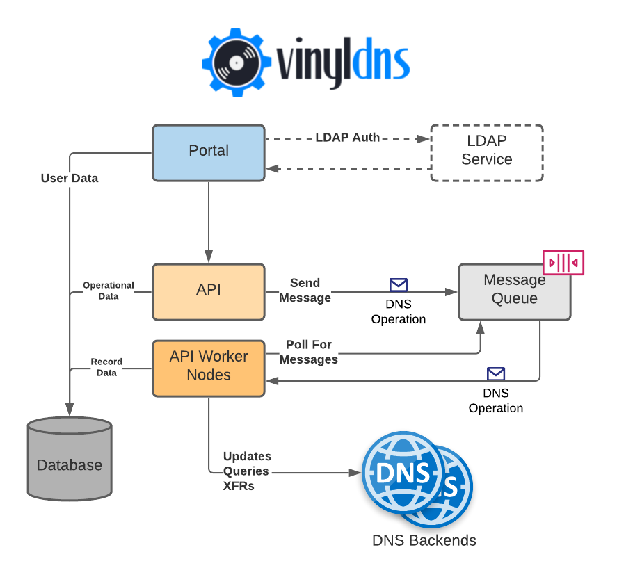

# System Design

## Table of Contents

- [Components](#components)
- [Process Flow](#process-flow)
- [Integration](#integration)

## Components

The following diagram illustrates the major components in the VinylDNS ecosystem and the external systems they interact
with.

| Component        | Description                                                                                                                                                      |
|------------------|------------------------------------------------------------------------------------------------------------------------------------------------------------------|
| Portal           | Web user interface to interact with the VinylDNS API                                                                                                             |
| API              | RESTful endpoints to allow interaction with VinylDNS                                                                                                             |
| API Worker Nodes | These are API components with `processing-disabled` set to `false` (see [documentation](https://www.vinyldns.io/operator/config-api.html#processing-disabled))   |
| Message queue    | Queue for DNS commands to enable flow control to the DNS backends (see [documentation](https://www.vinyldns.io/operator/pre.html#message-queues))                |
| Database         | Stores information about users, membership, and DNS records                                                                                                      |
| DNS Backend(s)   | The DNS backend servers which VinylDNS will query and update.                                                                                                    |
| LDAP Service     | The optional LDAP service that VinylDNS can be configured to communicate with (see [documentation](https://www.vinyldns.io/operator/setup-ldap.html#setup-ldap)) |

## Process Flow

1. LDAP service authenticates user credentials and grants access to the portal.
1. If the user is accessing the portal for the first time, VinylDNS credentials are generated and stored.
1. User navigates portal or uses integration tooling to generate a signed API request.
1. When the API receives a request, it loads the credentials for the calling user from the database and validates the
   request signature to ensure that the request was not modified in transit.
1. The request is then validated to ensure that:
    - the request data is correct
    - the request passes all validation checks
    - the user has access to make the change
1. Assuming the request is in good order, the request is put on a message queue for handling.
1. One of the VinylDNS API server instances pulls the message from the queue for processing. For record changes, a DDNS
   message is issued to the DNS backend server.
1. When the message completes processing, it is removed from the message queue. The changes are applied to the VinylDNS
   database along with an audit record for the request.

## Integration

Integrating with VinylDNS is simple since each API endpoint is effectively a distinct DNS operation (eg. create record,
update record, delete record, etc.). The only requirement for sending a request is generating the correct AWS SIG4
signature without content length and providing the corresponding HTTP headers so that VinylDNS can verify it.
See [API Authentication](https://www.vinyldns.io/api/auth-mechanism.html) for more details.

The current tooling available to perform VinylDNS API requests include:

* [go-vinyldns](https://github.com/vinyldns/go-vinyldns) - Golang client package
* [terraform-provider-vinyldns](https://github.com/vinyldns/terraform-provider-vinyldns) - A [Terraform](https://terraform.io/) provider for VinylDNS
* [vinyldns-cli](https://github.com/vinyldns/vinyldns-cli) - Command line utility written in Golang
* [vinyldns-java](https://github.com/vinyldns/vinyldns-java) - Java client
* [vinyldns-js](https://github.com/vinyldns/vinyldns-js) - JavaScript client
* [vinyldns-python](https://github.com/vinyldns/vinyldns-python) - Python client library
