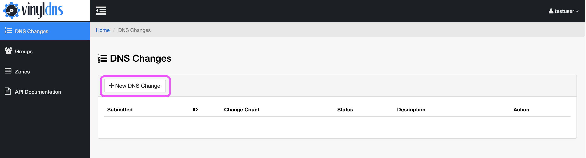
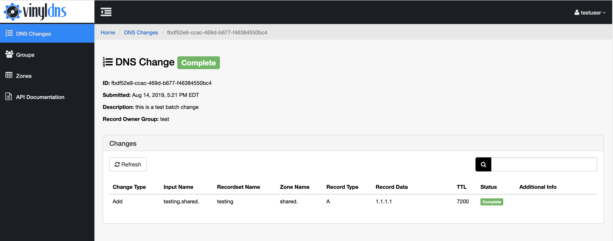

## Batch Changes
Batch Changes is an alternative to submitting individual RecordSet changes and provides the following:

* The ability to include records of multiple record types across multiple zones.
* Input names are entered as fully-qualified domain names (or IP addresses for **PTR** records), so users don't have to think in record/zone context.

#### Access
* Access permissions will follow existing rules (admin group or ACL access). Note that an update (delete and add of the same record name, zone and record type combination) requires **Write** or **Delete** access.
* **NEW** **Records in shared zones.** All users are permitted to create new records or update unowned records in shared zones.

#### Supported record types
* Current supported record types for Batch Change are: **A**, **AAAA**, **CNAME**, **PTR**, **TXT**, and **MX**.
* Additionally, there are **A+PTR** and **AAAA+PTR** types that will be processed as separate A (or AAAA) and PTR changes in the VinylDNS backend. Deletes for **A+PTR** and **AAAA+PTR** require Input Name and Record Data.
* Supported record types for records in shared zones may vary.
Contact your VinylDNS administrators to find the allowed record types.
This does not apply to zone administrators or users with specific ACL access rules.

#### Requirements
* DNS change requests must contain at least one change.
* The maximum number of single changes within a Batch change varies by instance of VinylDNS. Contact your VinylDNS administrators to find the Batch change limit for your instance.
* To update an existing record, you must delete the record first and add all expected records within the same request; a delete and add of the same record set within a Batch change request will be processed as an update.
* When creating a new record in a shared zone, or updating an existing unowned record, a record owner group is required. Once the owner group is assigned only users in that group, zone admins, and users with ACL permissions can modify the record.

---
### Create a Batch Change
1. Go to the Batch Changes section of the site.
1. Select the *New Batch Change* button.
1. Add a description.
1. Add record changes in one of two ways:
 - Select the *Add a Change* button to add additional rows for data entry as needed.
 - Select the *Import CSV* button to choose and upload a CSV file of the record changes. See [Batch Change CSV Import](#dns-change-csv-import) for more information.
1. Select the submit button. Confirm your submission.
 - If your submission was successful you'll redirect to the Batch Change summary page where you will see the status of the Batch Change request overall and of the individual records in the Batch Change.
 - If there are errors in the Batch Change you will remain on the form with prompts to correct errors before you attempt to submit again.

[{: .screenshot}](../img/portal/dns-change-main-annotated.png)
[{: .screenshot}](../img/portal/dns-change-new-annotated.png)
[{: .screenshot}](../img/portal/dns-change-summary.png)

#### Batch Change CSV Import
[Download a sample CSV here](../static/dns-changes-csv-sample.csv)
* The header row is required. The order of the columns is `Change Type, Record Type, Input Name, TTL, Record Data`.
* The TTL field is optional for each record, but the column is still required. If TTL is empty VinylDNS will use the existing TTL value for record updates or the default TTL value for new records.

### Review a Batch Change
You can review your submitted Batch Change requests by selecting the linked Batch ID or View button for the Batch Change on the main page of the Batch Change section in the portal.

[{: .screenshot}](../img/portal/dns-change-annotated.png)
