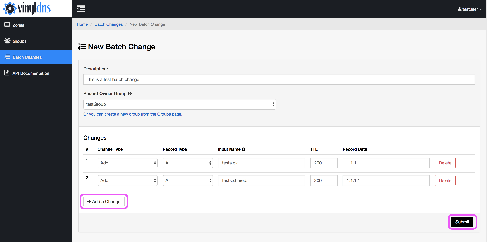
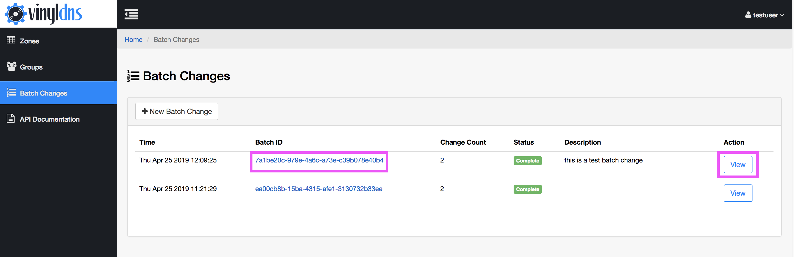

## Batch Changes
Batch change is an alternative to submitting individual RecordSet changes and provides the following:

* The ability to include records of multiple record types across multiple zones.
* Input names are entered as fully-qualified domain names (or IP addresses for **PTR** records), so users don't have to think in record/zone context.

To update an existing record, you must delete the record first and add all expected records within the same batch; a delete and add of the same recordset within a batch change request will be processed as an update.

Batch changes are also susceptible to the following restrictions:
* Current supported record types for batch change are: **A**, **AAAA**, **CNAME**, **PTR**, **TXT**, and **MX**. Additionally, there are **A+PTR** and **AAAA+PTR** types that, behind the scenes, will be processed as separate A (or AAAA) and PTR changes, and will appear in the completed batch change summary as separate items.
* Batch change requests must contain at least one change.
* The maximum number of single changes within a batch change varies by instance of VinylDNS. Contact your VinylDNS administrators to find the batch change limit for your instance.
* Access permissions will follow existing rules (admin group or ACL access). Note that an update (delete and add of the same record name, zone and record type combination) requires **Write** access.

### Create a Batch Change
1. Go to the Batch Changes section of the site.
1. Select the *New Batch Change* button.
1. Add a description and record changes. Select the *Add a Change* button to add additional rows for data entry as needed.
1. Select the submit button. Confirm your submission.
 - If your submission was successful you'll redirect to the batch change summary page where you will see the status of the batch change request overall and of the individual records in the batch change.
 - If there are errors in the batch change you will remain on the form with prompts to correct errors before you attempt to submit again.

[{: .screenshot}](../img/portal/batch-change-main-annotated.png)
[{: .screenshot}](../img/portal/batch-change-new-annotated.png)
[{: .screenshot}](../img/portal/batch-change-summary.png)

### Review a Batch Change
You can review your submitted batch change requests by selecting the linked Batch ID or View button for the batch change on the main page of the Batch Change section in the portal.

[{: .screenshot}](../img/portal/batch-change-annotated.png)
