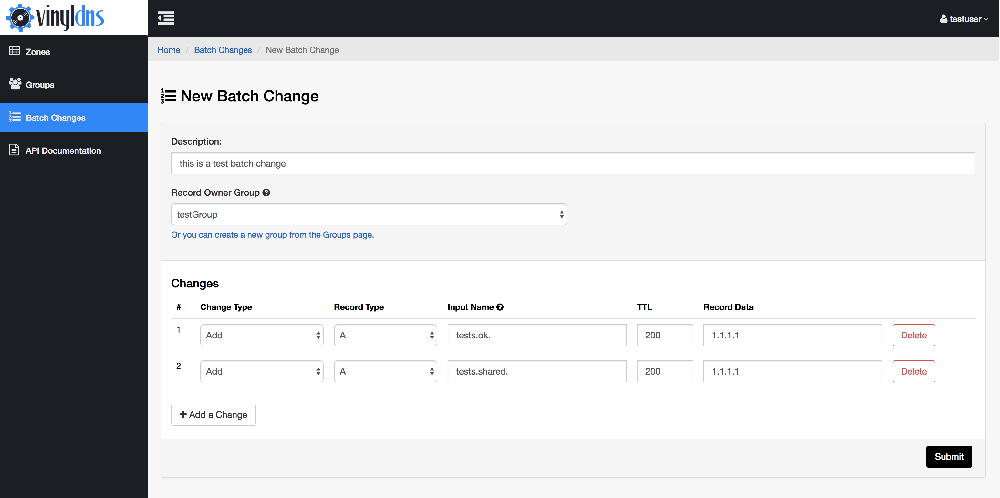

## Batch Changes
Batch change is an alternative to submitting individual RecordSet changes and provides the following:

* The ability to include records of multiple record types across multiple zones.
* Input names are entered as fully-qualified domain names (or IP addresses for **PTR** records), so users don't have to think in record/zone context.

To update an existing record, you must delete the record first and add the record again with the updated changes.

Batch changes are also susceptible to the following restrictions:
* Current supported record types for batch change are: **A**, **AAAA**, **CNAME**, and **PTR**.
* Batch change requests must contain at least one change.
* The maximum number of single changes within a batch change is currently set to 20.
* Access permissions will follow existing rules (admin group or ACL access). Note that an update (delete and add of the same record name, zone and record type combination) requires **Write** access.

{: .screenshot}
{: .screenshot}
{: .screenshot}
