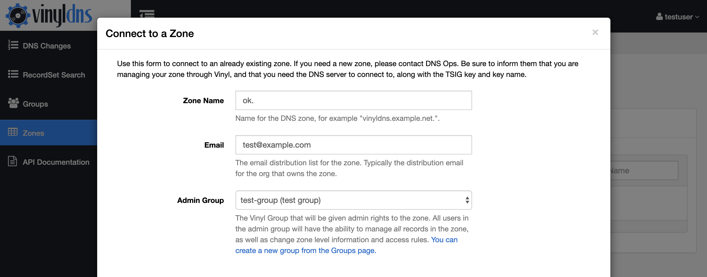

## Connecting to your Zone 
Once your zone is setup for use with VinylDNS, you can use the VinylDNS portal to connect to it.

1. Select the Groups link in the navigation and [create an Admin Group](groups#create-a-group) for your zone.
1. Select the Zones link from the navigation, then click the *Connect* button.  This will show the zone connect
  form. {: .screenshot} {: .screenshot}
1. Enter the full name of the zone, example "test.sys.example.com"
1. Enter the email distribution list for the zone.  This is typically a distribution list
  email for the team that owns the zone.</li>
1. Select the Admin Group for the zone.</li>
1. If you do not have any custom TSIG keys, you can leave the connection information empty.</li>
1. If you do have custom TSIG keys, read the section below on <i>Understanding Connections</i></li>
1. Click the <i>Connect</i> button at the bottom of the form.</li>
1. You may have to click the <i>Refresh</i> button from the zone list to see your new zone.
{: .screenshot}
1. If you see error messages, please consult the FAQ.
