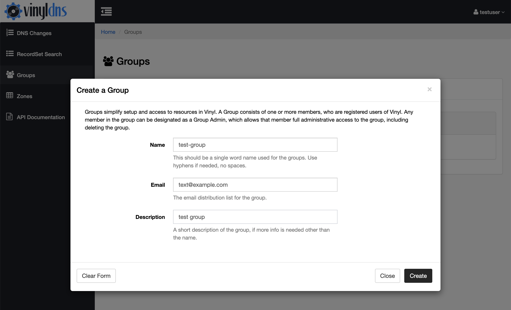
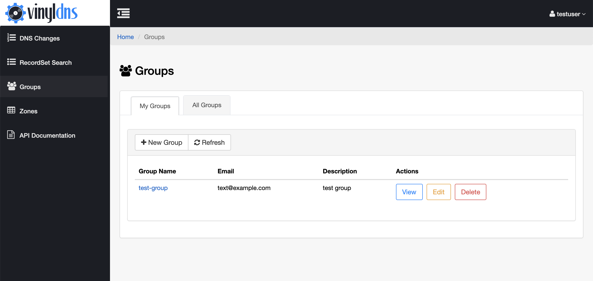

## Connecting to your Zone 
Once your zone is setup for use with VinylDNS, you can use the VinylDNS portal to connect to it.

<ol>
  <li> Select the Groups link in the navigation and create an Admin Group for your zone.
  

    
<strong>Screenshots</strong>

    

    

    

  

  </li>
  <li> Select the Zones link from the navigation, then click the <i>Connect</i> button.  This will show the zone connect
  form.
  

  
<strong>Screenshots</strong>

  

  

  

  </li>
  <li> Enter the full name of the zone, example "test.sys.example.com"</li>
  <li> Enter the email distribution list for the zone.  This is typically a distribution list
  email for the team that owns the zone.</li>
  <li> Select the Admin Group for the zone.</li>
  <li> If you do not have any custom TSIG keys, you can leave the connection information empty.</li>
  <li> If you do have custom TSIG keys, read the section below on <i>Understanding Connections</i></li>
  <li> Click the <i>Connect</i> button at the bottom of the form.</li>
  <li> You may have to click the <i>Refresh</i> button from the zone list to see your new zone.
  

  
<strong>Screenshot</strong>

  

  

  </li>
  <li> If you see error messages, please consult the FAQ.</li>
</ol>
