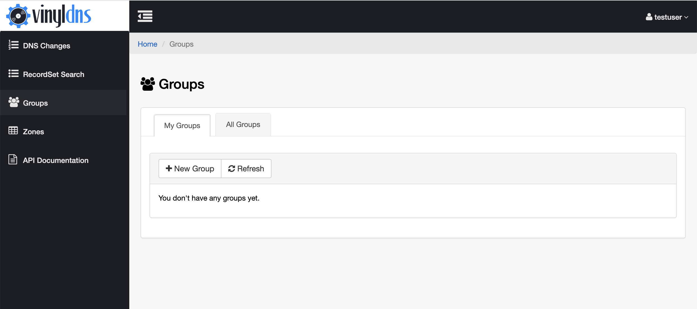
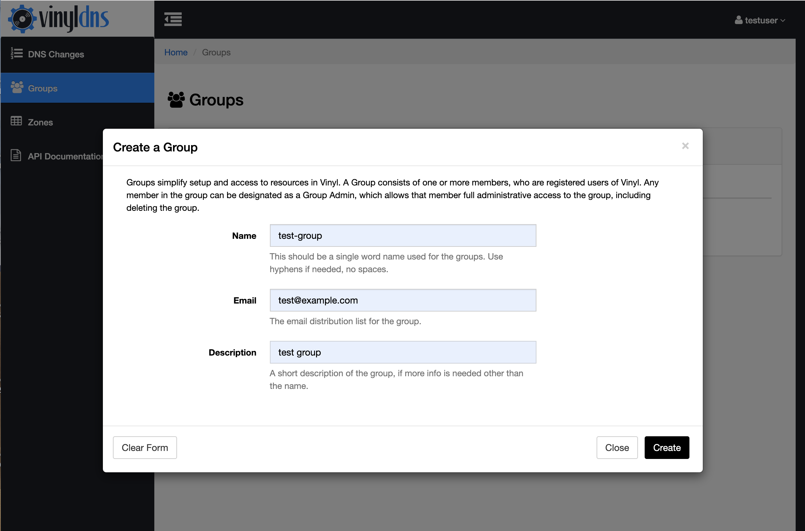
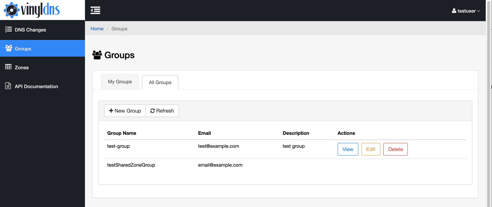

## Create a group
1. In the Groups area of the site select the *New Group* button. This will bring up a form.
1. Enter a name for the group, email address and an optional description.
1. Select the *Create* button to submit the group information.
1. If all fields are valid you'll see the group listed in the table on the screen when the form closes.

[{: .screenshot}](../img/portal/groups-main.png)
[{: .screenshot}](../img/portal/create-group.png)
[{: .screenshot}](../img/portal/groups-listed.png)
[{: .screenshot}](../img/portal/groups-listed-all.png)
