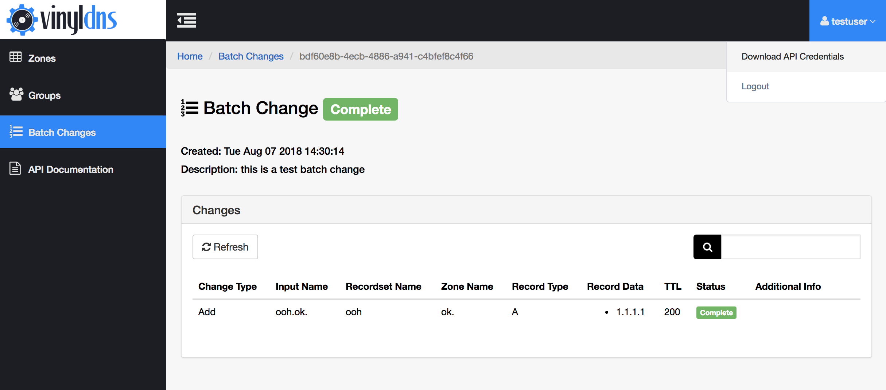

## Credentials
While there are other [tools](/tools) that you can use to work with VinylDNS, at this time all users must go through the VinylDNS portal to retrieve their credentials. These credentials are required to use the tools and the API. The credentials are located in the top right corner of the site after login.

[{:.screenshot}](../img/portal/credentials.png)
