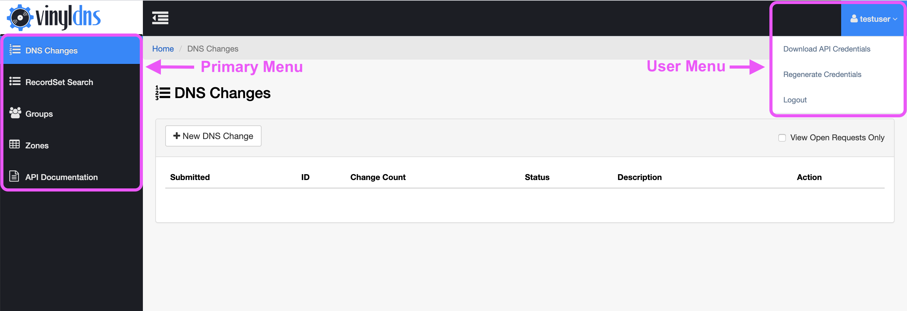

# Portal Guide

The VinylDNS portal is the primary user interface for interacting with VinylDNS. Users can retrieve their credentials and manage zones, records, and user groups. This guide covers the functionality of the portal.

## Navigating the Portal

[{:.screenshot}](../img/portal/main-annotated.png)

### User Menu
The User Menu is located in the top right corner of the portal and accessed by selecting your username. It contains a *Logout* link to sign out of the portal and the *Download Credentials* link.

#### Credentials
In order to use [tooling](/tools) to access VinylDNS, all users must download their credentials from the VinylDNS portal.

[Learn more](credentials)

### Zones
The Zones section of the portal is for managing DNS zones and records. This area also includes more granular management of user abilities.
To access Zones in the portal select the Zones link in the left column navigation.
Access to individual zones in this part of the portal is limited to zone administrators and users with explicit permissions.

[Learn More](zones)

### Groups
The Groups section of the portal is for managing high level user access and abilities. To access Groups in the portal select the Groups link in the left column navigation.

[Learn More](groups)

### Batch Changes
The Batch Changes section of the portal allows users to implement multiple record changes simultaneously and across different zones. To access Batch Changes in the portal select the Batch Changes link in the left column navigation.

[Learn More](batch-changes)
