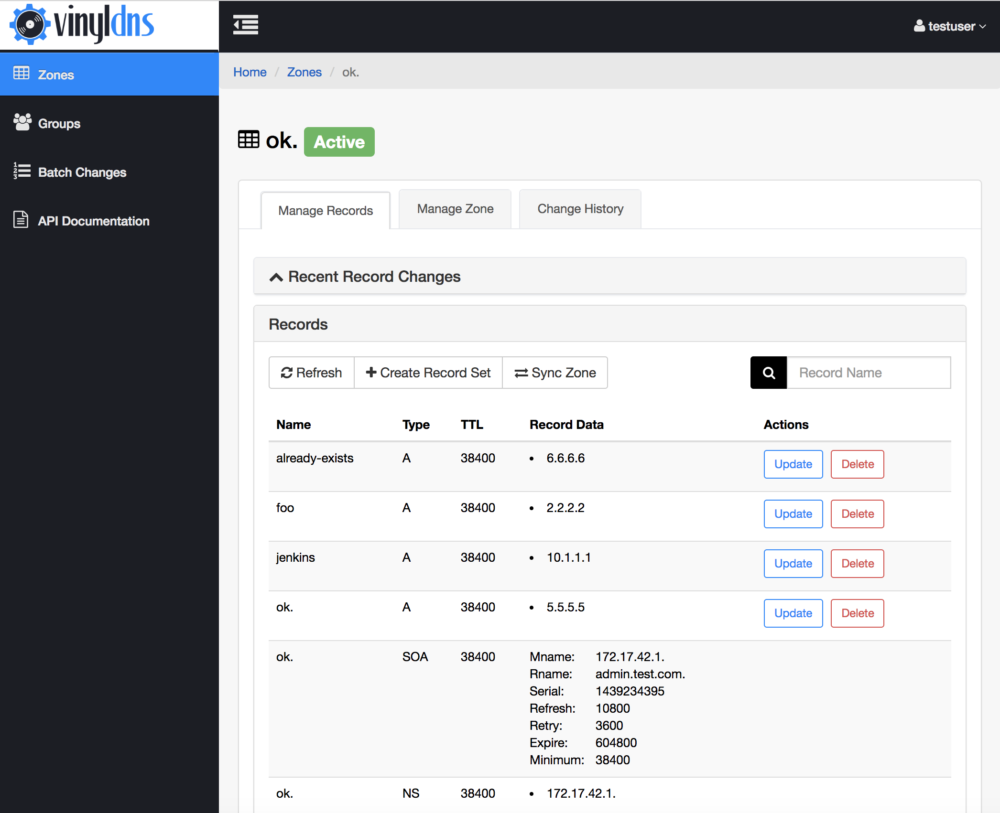
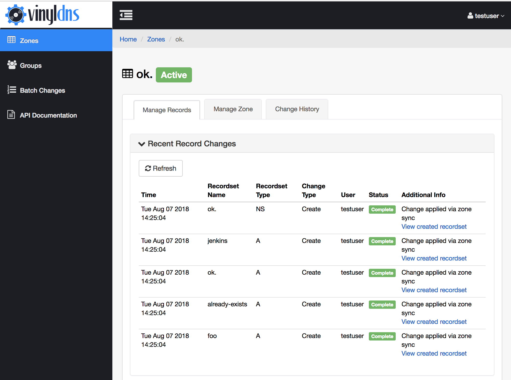
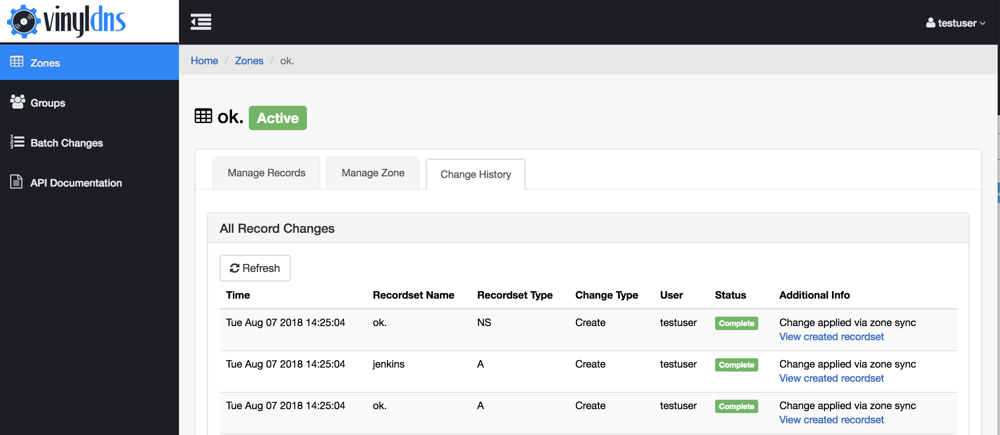

## Manage Records 
There are currently two ways to manage records in the VinylDNS portal. This covers managing individual records through their associated zone. To manage multiple records, possibly across zones, you can use the [Batch Change](batch-changes) area of the portal.

Current supported record types in Zones are: **A**, **AAAA**, **CNAME**, **MX***, **PTR**, **NS**, **TXT**, **SPF**, **SRV**,  and **SSHFP**.

To manage records in a zone go to the *Zones* section of the portal and select the *View* button that corresponds with the zone you want to manage. The *Manage Records* tab will be the active tab by default. Once you are in the *Manage Records* tab of the zone, you can create new records sets or update or delete existing record sets.

[{: .screenshot}](../img/portal/zone-records.png)

The *Records* pane, below the *Recent Record Changes* pane, lists record sets. Record sets are records that have the same
name but different record data.  Not all record types support record sets.

When you make any change, it will be issued *immediately* upon confirming
the change to the DNS backend.

If for any reason the change failed, you can view the change in the *Recent Record Changes* pane
at the top of the screen, or look at the *Change History* tab to see what went wrong.
The *Additional Info* column will contain details of the change failure.

[{: .screenshot}](../img/portal/manage-records.png)
[{: .screenshot}](../img/portal/change-history.png)
