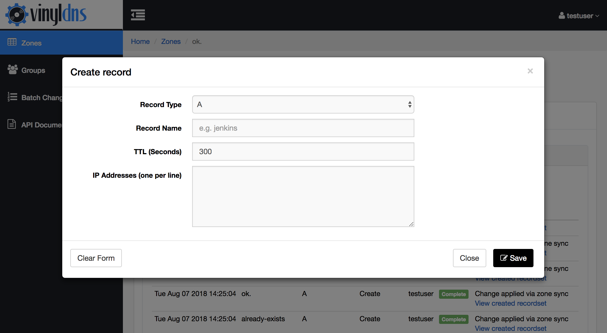
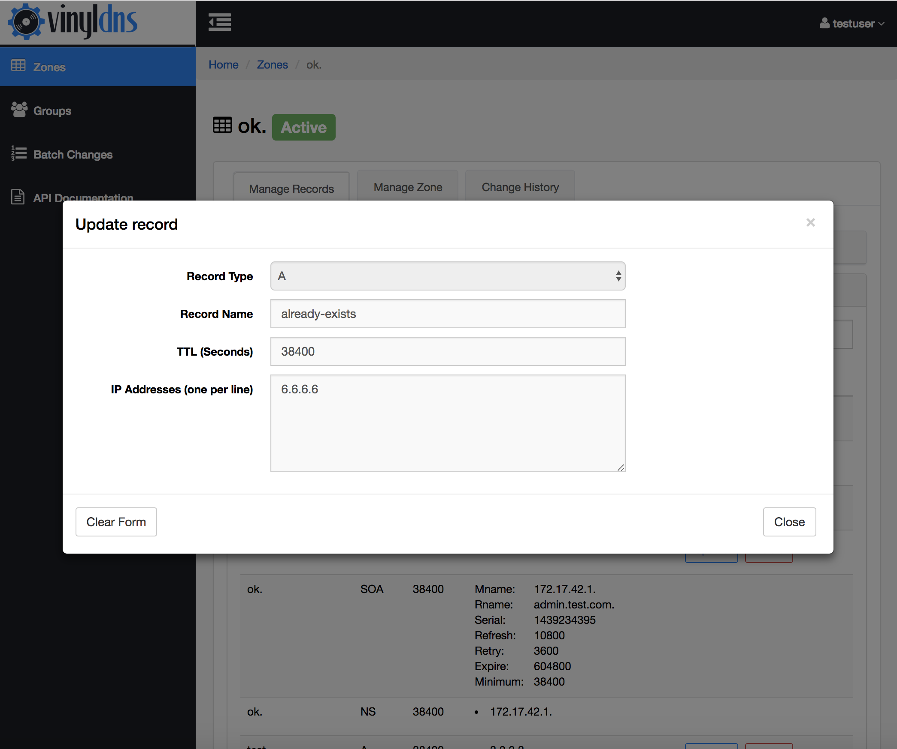
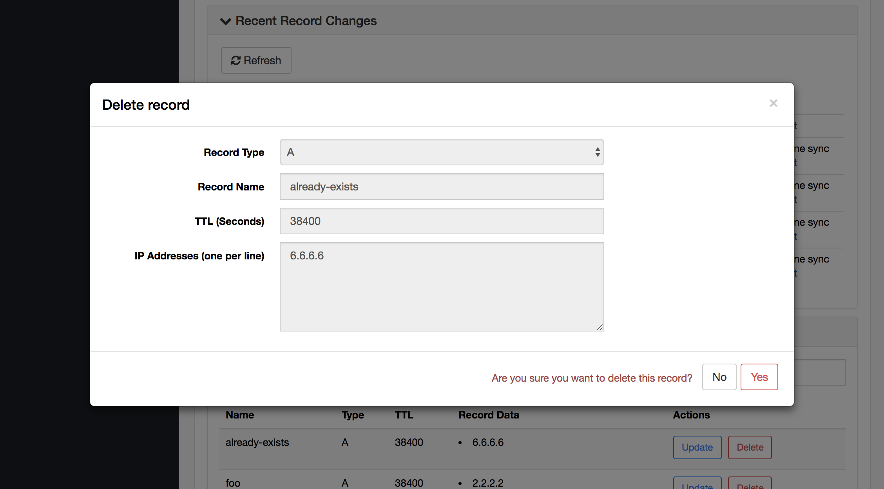

## Manage Records 
In the *Manage Records* tab in your zone, you can create, update, and delete existing records.
{: .screenshot}

### To create a record
Select the *Create Record Set* button in the *Records* pane and fill in the form.
{: .screenshot}

### To update a record
Select the *Update* button next to the record in the *Records* pane and fill in the form.
{: .screenshot}

### To delete a record
Select the *Delete* button next to the record in the *Records* pane and select the Yes button in the form to confirm.
{: .screenshot}

The Record View lists *Record Sets*, which are records that have the same
name but different record data.  Not all record types support record sets.

When you make any change, it will be issued *immediately* upon confirming
the change to the DNS backend.

If for any reason the change failed, you can view the change in the *Recent Changes* pane
at the top of the screen, or look at the *Change History* tab to see what went wrong.
The *Additional Info* column will contain details of the change failure.

{: .screenshot}
{: .screenshot}
