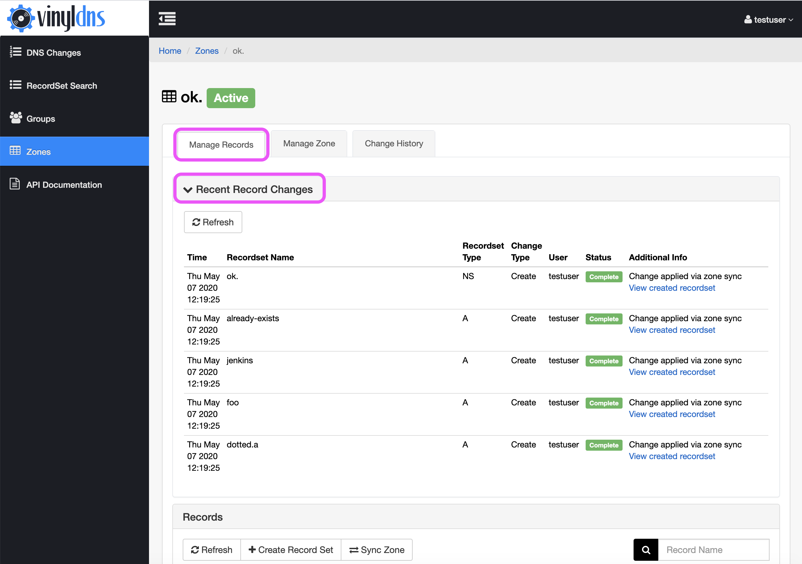

## Manage Records 
There are currently two ways to manage records in the VinylDNS portal. This covers managing individual records through their associated zone. To manage multiple records at once, possibly across zones, and records in shared zones you can use the [DNS Changes](dns-changes) area of the portal.

#### Access
Only zone administrators and users with ACL rules can manage records this way.

#### Supported record types
A, AAAA, CNAME, DS, MX, NAPTR, NS, PTR, SRV, SSHFP, and TXT

---

To manage records in a zone go to the *Zones* section of the portal and select the *View* button that corresponds with the zone you want to manage. The *Manage Records* tab will be the active tab by default. Once you are in the *Manage Records* tab of the zone, you can create new records sets or update or delete existing record sets.

[{: .screenshot}](../img/portal/zone-records-annotated.png)

The *Records* pane, below the *Recent Record Changes* pane, lists record sets. Record sets are records that have the same
name but different record data.  Not all record types support record sets.

When you make any change, it will be immediately queued for processing. Typically processing happens in a second or two. You may need to select the *Refresh* button if you don't see the change reflected in the portal.

If for any reason the change failed, you can view the change in the *Recent Record Changes* pane
at the top of the screen, or look at the *Change History* tab to see what went wrong.
The *Additional Info* column will contain details of the change failure.

[{: .screenshot}](../img/portal/manage-records-annotated.png)
[{: .screenshot}](../img/portal/change-history-annotated.png)

### Sync Zones
If you make changes to the records in a zone outside of VinylDNS you must manually sync the zone so VinylDNS is aware of those records. Use the *Sync Zone* button in the *Records* pane.

[{: .screenshot}](../img/portal/sync-zones-annotated.png)
