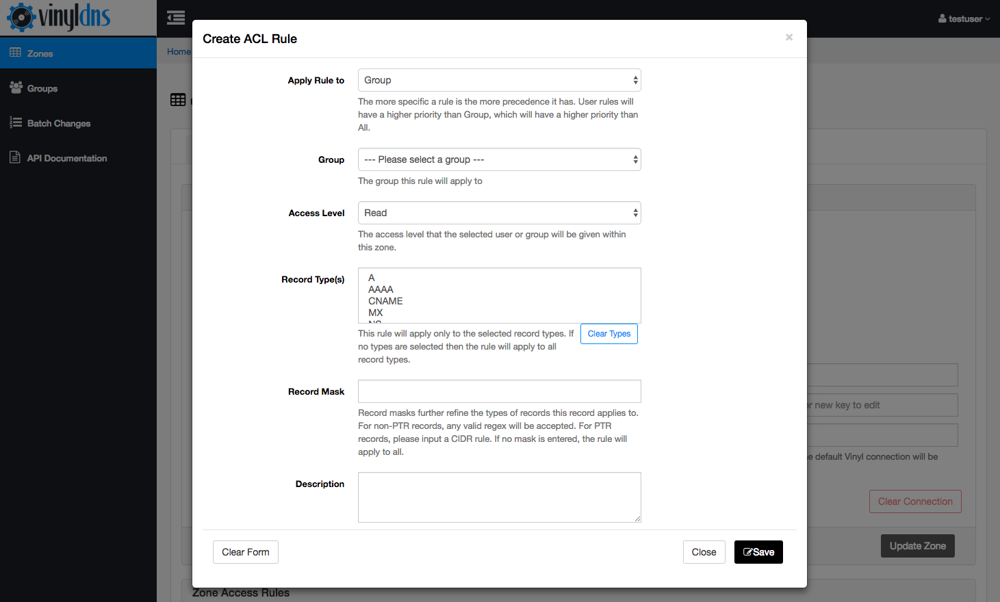

## Managing Access to Zones and Records 
#### Full Access
If you wish to add other users to a group you can select the View button on the group to manage the members.  Members of a zone admin group have *full* access
to all records and permissions in the zone.  Typically, this should be a limited set of
users.

<strong>Screenshot</strong>

#### Limited Access
If you wish to limit user abilities within a zone you can create ACL rules in the Zone.
1. Go to the desired zone
1. Select the Manage Zone tab
1. Select the Create ACL rule button
1. Fill in the form

<strong>Screenshot</strong>

  
