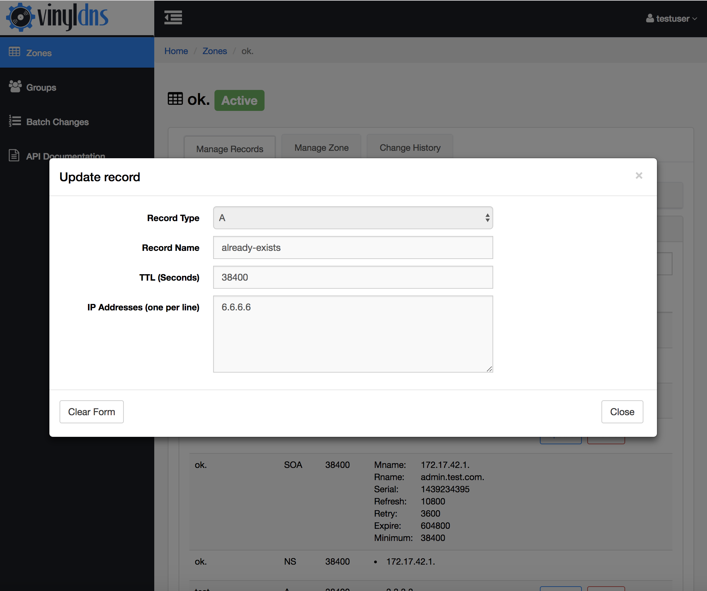

## Managing Records 
In the *Manage Records* tab in your zone, you can create, update, and delete
existing records.

<ul>
<li> To create a record select the <i>Create Record Set</i> button in the <i>Records</i> pane and fill in the form.</li>
<li> To update a record select the <i>Update</i> button next to the record in the <i>Records</i> pane and fill in the form.</li>
<li> To delete a record select the <i>Delete</i> button next to the record in the <i>Records</i> pane and select the Yes button in the form to confirm.</li>

<strong>Screenshots</strong>

</ul>

The Record View lists *Record Sets*, which are records that have the same
name but different record data.  Not all record types support record sets.

When you make any change, it will be issued *immediately* upon confirming
the change to the DNS backend.

If for any reason the change failed, you can view the change in the *Recent Changes* pane
at the top of the screen, or look at the *Change History* tab to see what went wrong.
The *Additional Info* column will contain details of the change failure.

<strong>Screenshots</strong>

