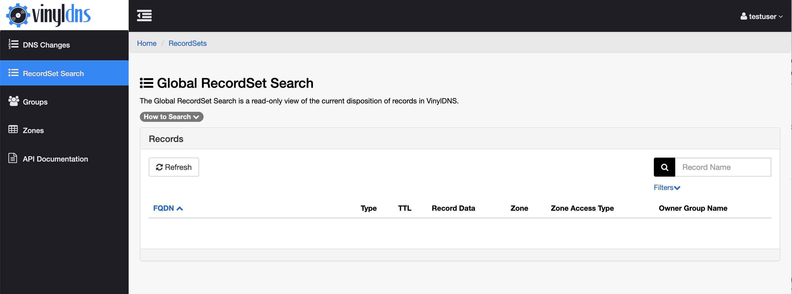
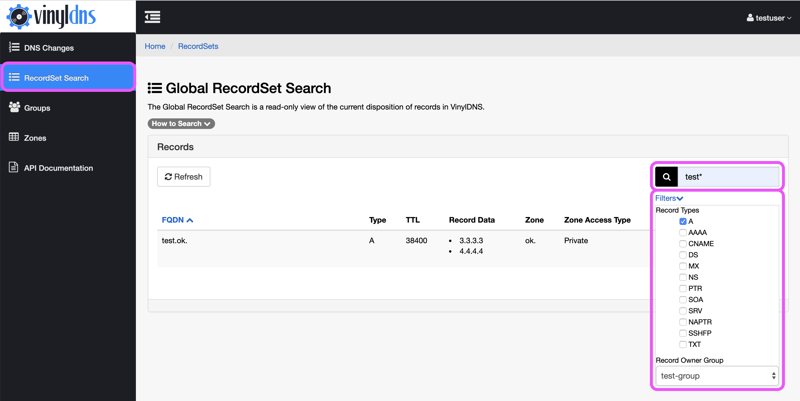
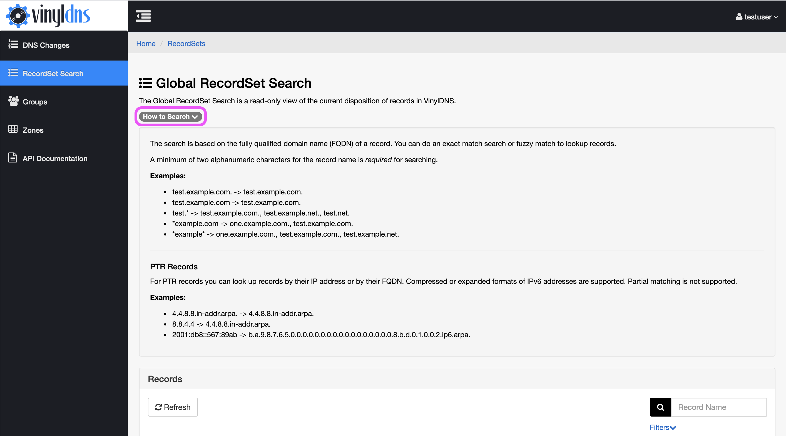

## RecordSet Search
RecordSet Search provides a view to lookup the state of DNS records within VinylDNS without requiring
access to the specific zone. To use the search, a search term containing at least two alphanumeric characters must
be entered.

[{: .screenshot}](../img/portal/recordset-search-main.png)
[{: .screenshot}](../img/portal/recordset-search-name-filter.png)

Record type and/or record owner group to further filter the search results.

[{: .screenshot}](../img/portal/recordset-search-filters.png)

There is also a collapsible help section that provides further information regarding search querying tips.

[{: .screenshot}](../img/portal/recordset-search-info.png)
