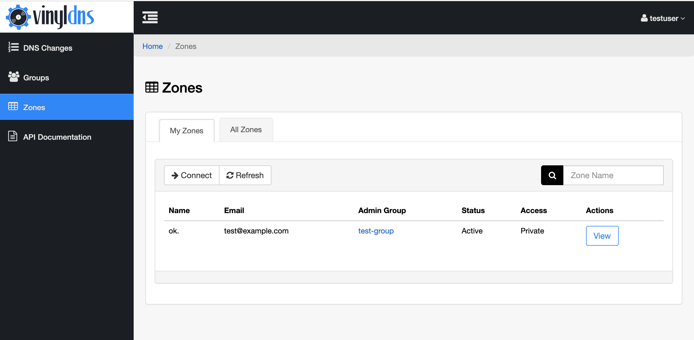

## Zones

Zones is the core area of the VinylDNS portal. All zones you have access to are found here along with their records and change history. **Note** you may have access to specific records in shared zones, in which case you will not see those zones in this area. Those records are accessible via the [Batch Change](batch-changes) area of the portal. 

* [Connect to your zone](connect-to-zone)
* [Manage records](manage-records)
* [Manage access](manage-access)
* [Understand connections](understand-connections)

[{:.screenshot}](../img/portal/zone-list.png)
